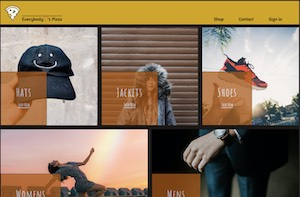

# Everybody &#9825;'s Pizza

## Preview:

## Things I learned:
- `Firebase`/`Firestore`
- Setting up `OAuth2.0` with   
- How to setup a simple email and password sign-up/sign-in
- Really honing in on destructuring, componentizing, and optimizing code 
- Great experience working with "out-of-the-box" API calls instead of `fetch`

## Challenges I faced while building this:
1. Getting through the verification processes with each of the third party auth providers was a little rough. They all have different ways of doing things and it leads to a very clunky development experience when trying to give the users a few options for signing in/up
2. Working out the potential issues with the <`ReactModal`/> component and screen readers was irritating. Needing to assign a definition for the `appElement` made me really wish I could just use a regular HTML `dialog` element without having to write tons of extra code to make it work.
3. Cross-Origin-Opener-Policy.
4. Working with Firebase wasn't terribly difficult but
`..... in progress`